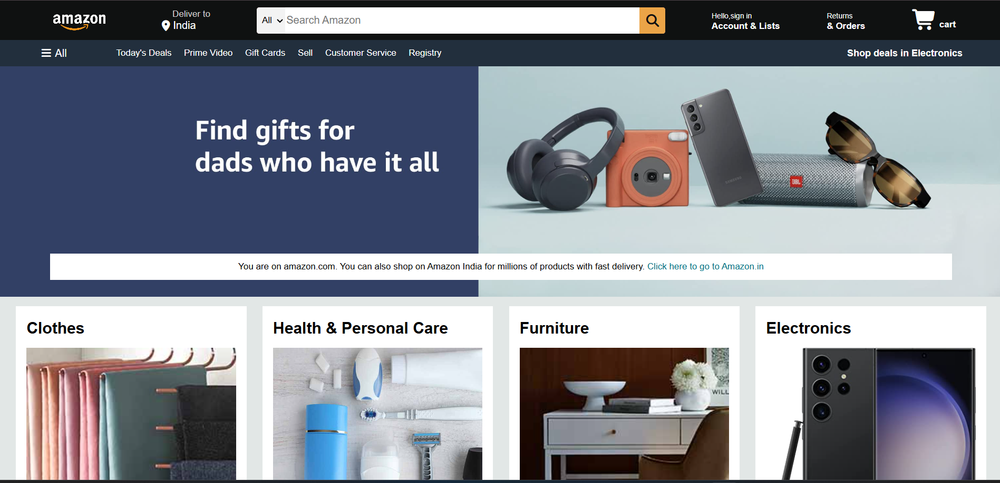

# 🛒 Amazon Homepage Clone

A frontend UI clone of the Amazon homepage built using **HTML and CSS**. This project focuses on recreating the basic layout and visual appearance of the Amazon shopping homepage.

## ✨ Features

* Amazon-style navigation bar
* Search bar
* Product/category sections
* Promotional banners
* Product cards
* Footer section

## 🛠️ Technologies Used

* HTML5
* CSS3

## 📸 Preview

A frontend UI clone of the Amazon homepage built using **HTML and CSS**. This project focuses on recreating the basic layout and visual appearance of the Amazon shopping homepage.

## ✨ Features

* Amazon-style navigation bar
* Search bar
* Product/category sections
* Promotional banners
* Product cards
* Footer section

## 🛠️ Tech Stack

  
  

## 👨‍💻 Author

**Kunal Kasar**

